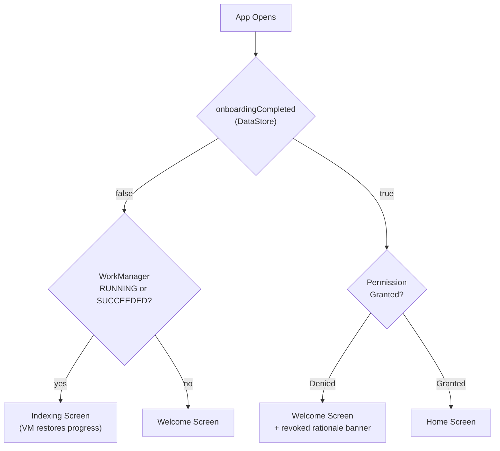

<!--firebender-plan
name: App Startup Routing
overview: Implement intelligent app startup routing using a DataStore-backed flag and `PermissionChecker` to correctly direct users to Welcome, Indexing, or Home depending on their state — handling permission revocation, mid-indexing restarts, DB clears, and new gallery images.
todos:
  - id: datastore-dep
    content: "Add DataStore Preferences dependency to libs.versions.toml and androidApp/build.gradle.kts"
  - id: app-preferences
    content: "Create AppPreferences class with DataStore backing for onboarding_completed flag"
  - id: startup-usecase
    content: "Create DetermineStartDestinationUseCase that combines AppPreferences + PermissionChecker + IndexingWorkRepository"
  - id: app-module
    content: "Update AppModule.provideNavigator() to call DetermineStartDestinationUseCase and set correct initial destination"
  - id: onboarding-contract
    content: "Add permissionPreviouslyRevoked: Boolean to OnboardingUiState"
  - id: onboarding-vm
    content: "Inject AppPreferences into OnboardingViewModel: write onboarding_completed on ExploreGallery, seed permissionRevoked state"
  - id: welcome-screen
    content: "Add conditional inline rationale banner to WelcomeScreen when permissionPreviouslyRevoked is true"
-->

# App Startup Routing

## Decision Tree

**Scenario mapping:**
- **First launch** → `onboardingCompleted = false`, no worker → Welcome
- **App killed mid-indexing** → `onboardingCompleted = false`, worker RUNNING → Onboarding route (ViewModel already restores Indexing page)
- **Onboarding done, reopen** → `onboardingCompleted = true`, permission OK → Home
- **Permission revoked after onboarding** → `onboardingCompleted = true`, permission DENIED → Welcome with rationale banner
- **DB cleared (app data wiped)** → DataStore also wiped, so `onboardingCompleted = false` → Welcome (fresh start)
- **New images in gallery** → User is already on Home; handled by auto-re-index in background (not an onboarding concern)

---

## Files to Create / Modify

### 1. Add DataStore dependency
- [`gradle/libs.versions.toml`](gradle/libs.versions.toml) — add `androidx-datastore-preferences` version + alias
- [`androidApp/build.gradle.kts`](androidApp/build.gradle.kts) — add dependency

### 2. Create `AppPreferences` (androidApp DI)
New file: `androidApp/.../di/AppPreferences.kt`
- DataStore Preferences holding a single key: `onboarding_completed: Boolean`
- Exposes `suspend fun isOnboardingCompleted(): Boolean` and `suspend fun setOnboardingCompleted()`

### 3. Create `DetermineStartDestinationUseCase` (androidApp)
New file: `androidApp/.../startup/DetermineStartDestinationUseCase.kt`
- Suspending use case that reads `AppPreferences` + `PermissionChecker` + `IndexingWorkRepository`
- Returns one of: `StartDestination.Welcome`, `StartDestination.Indexing`, `StartDestination.Home`
- `StartDestination.Welcome` carries a `Boolean permissionRevoked` flag

### 4. Update `AppModule` — Navigator start destination
[`androidApp/.../di/AppModule.kt`](androidApp/src/main/java/com/helios/auraroll/android/di/AppModule.kt)
- Inject `DetermineStartDestinationUseCase` and call it with `runBlocking { useCase() }` in `provideNavigator()` to set the correct initial back-stack entry before the Activity is visible

### 5. Extend `OnboardingContract`
[`OnboardingContract.kt`](feature/onboarding/impl/src/main/java/com/helios/auraroll/onboarding/impl/ui/OnboardingContract.kt)
- Add `permissionPreviouslyRevoked: Boolean` to `OnboardingUiState` (drives the rationale banner in WelcomeScreen)

### 6. Update `OnboardingViewModel`
[`OnboardingViewModel.kt`](feature/onboarding/impl/src/main/java/com/helios/auraroll/onboarding/impl/ui/OnboardingViewModel.kt)
- Inject `AppPreferences`
- On `ExploreGallery` intent: call `appPreferences.setOnboardingCompleted()` before emitting `NavigateToHome`
- Accept a `permissionRevoked: Boolean` constructor param (passed from the nav entry) to seed the initial state

### 7. Update `WelcomeScreen`
[`WelcomeScreen.kt`](feature/onboarding/impl/src/main/java/com/helios/auraroll/onboarding/impl/ui/WelcomeScreen.kt)
- If `uiState.permissionPreviouslyRevoked == true`, show a subtle inline banner: _"Photo access was removed. Grant permission to continue."_

---

## Notes
- `runBlocking` in `provideNavigator()` is acceptable: it runs before the Activity's first frame is drawn and the DataStore read is a single disk read (~ms).
- "New images in gallery" is not an onboarding concern — the Home screen / a background worker will handle incremental re-indexing.
- The `Indexing` start destination is not a new nav destination; the VM's existing `init` block already detects the running WorkManager job and restores the Indexing page, so the Navigator only ever needs `Onboarding` or `Home` as its start.
