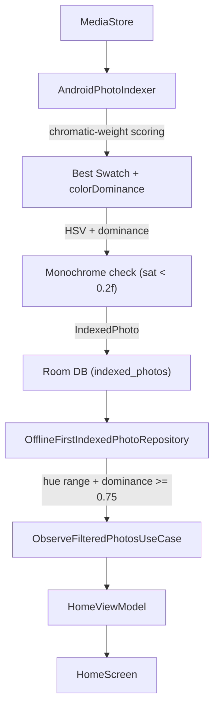

<!--firebender-plan
name: Fix Hue Indexing Algorithm
overview: The photo hue indexing produces incorrect results because the swatch selection strategy picks neutral/background colors instead of the most prominent chromatic color. This causes photos with warm-neutral backgrounds (cardboard, tan fur, beige walls) to be incorrectly indexed as "red" (hue near 0°/360°). Additionally, photos where the selected hue covers less than 75% of the palette population will be filtered out.
todos:
  - id: fix-swatch-selection
    content: "Replace dominantSwatch-first strategy with saturation×population scoring in AndroidPhotoIndexer.kt"
  - id: raise-sat-threshold
    content: "Raise monochrome saturation threshold from 0.1f to 0.2f in AndroidPhotoIndexer.kt"
  - id: add-dominance-field
    content: "Add colorDominance: Float field to IndexedPhoto and store it during indexing"
  - id: filter-by-dominance
    content: "Add MIN_COLOR_DOMINANCE = 0.75f constant and filter by colorDominance in DAO queries"

-->

# Fix Hue Indexing Algorithm

## Root Cause Analysis

There are **two bugs** stacked together in [`AndroidPhotoIndexer.kt`](shared/src/androidMain/kotlin/com/helios/auraroll/indexing/AndroidPhotoIndexer.kt):

### Bug 1: Wrong swatch selection — the most critical bug

```kotlin
// Line 112 — CURRENT (broken)
val bestSwatch = palette.dominantSwatch ?: palette.vibrantSwatch ?: ...
```

`palette.dominantSwatch` is **never null** when any swatches exist — it is always the swatch with the most pixels. The fallback to `vibrantSwatch` is effectively unreachable.

For real-world photos, the pixel-dominant area is usually the **background** (table surface, bed sheets, walls, clothing). These backgrounds are often neutral warm tones (beige, tan, cardboard brown) with:
- Saturation ~0.10–0.25 (above the monochrome threshold of `0.1f`)
- Hue in the **0–60° red/orange range** (warm cast)

Result: keyboard photo, cat photo, and box photos all get indexed as near-red because their large warm-neutral backgrounds win the pixel count contest.

### Bug 2: Saturation monochrome threshold too low

```kotlin
// Line 124 — CURRENT (too permissive)
val isMonochrome = sat < 0.1f || brightness < 0.1f
```

A saturation of `0.1f–0.2f` is still a visually near-neutral color. These desaturated warm tones get classified as "colored" photos and their hue (typically red-orange) pollutes the filter. Raising to `0.2f` prevents washed-out neutrals from entering the color index.

---

## Fixes

### Fix 1: Replace swatch selection with chromatic-weight scoring (`AndroidPhotoIndexer.kt`)

Score each swatch by `saturation × population`. This balances *"how colorful is it"* against *"how many pixels have it"*, so a vivid red subject with 10% of pixels beats a beige background with 60% of pixels.

```kotlin
val bestSwatch = palette.swatches
    .maxByOrNull { swatch ->
        val hsv = FloatArray(3)
        Color.colorToHSV(swatch.rgb, hsv)
        val sat = hsv[1]
        val brightness = hsv[2]
        // Exclude near-monochrome swatches from the scoring so they don't win
        if (sat < 0.2f || brightness < 0.15f) 0f else sat * swatch.population
    }
    ?: palette.dominantSwatch // fallback only for truly monochrome images with no colorful swatch
```

### Fix 2: Raise monochrome saturation threshold (`AndroidPhotoIndexer.kt`)

```kotlin
// NEW
val isMonochrome = sat < 0.2f || brightness < 0.1f
```

### Fix 3: Add `colorDominance` field to `IndexedPhoto.kt`

Store how dominant the winning swatch is relative to the full palette's total pixel population. This is computed as:

```
colorDominance = bestSwatch.population / palette.swatches.sumOf { it.population }
```

- New field: `val colorDominance: Float = 0f` on `IndexedPhoto`
- Computed and stored during indexing in `AndroidPhotoIndexer`

### Fix 4: Filter by dominance in `IndexedPhotoDao.kt` + constant in `HueUtils.kt`

Add `MIN_COLOR_DOMINANCE = 0.75f` to [`HueUtils.kt`](shared/src/commonMain/kotlin/com/helios/auraroll/hue/HueUtils.kt) (shared module).

Update both hue-range DAO queries to add `AND colorDominance >= :minDominance`:

```sql
SELECT * FROM indexed_photos
WHERE hue >= :minHue AND hue <= :maxHue
  AND isMonochrome = 0
  AND colorDominance >= :minDominance
ORDER BY id DESC
```

Pass `MIN_COLOR_DOMINANCE` through `OfflineFirstIndexedPhotoRepository` → `ObserveFilteredPhotosUseCase` → `HomeViewModel`.

---

## Data Flow (for reference)


