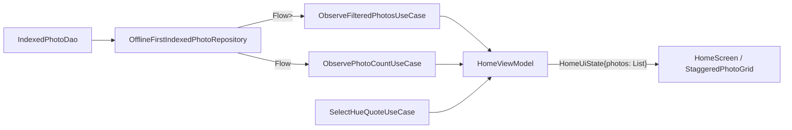

<!--firebender-plan
name: home_kmp_anti_pattern_cleanup
overview: Stop leaking the Room entity `IndexedPhoto` into Compose, move home use cases into `:shared` per the KMP-first rule, and remove a couple of related smells (Android color helper, quote selection logic in ViewModel).
todos:
  - id: domain-model
    content: "Add shared Photo domain model + IndexedPhoto -> Photo mapper"
  - id: repo-mapping
    content: "Update IndexedPhotoRepository + OfflineFirstIndexedPhotoRepository to expose Flow<List<Photo>>"
  - id: move-usecases
    content: "Move ObserveFilteredPhotosUseCase / ObservePhotoCountUseCase to :shared as plain classes; add Hilt @Provides in feature/home/impl"
  - id: quote-usecase
    content: "Extract quote selection + random insert index logic into SelectHueQuoteUseCase in :shared"
  - id: ui-photo
    content: "Update HomeUiState, HomeScreen, StaggeredPhotoGrid to use Photo instead of IndexedPhoto"
  - id: hue-color
    content: "Replace android.graphics.Color.HSVToColor with Compose Color.hsv() in hueToColor"
-->


## Anti-patterns found

1. **DB entity in UI**: `IndexedPhoto` (a Room `@Entity` with internal fields like `hue`, `saturation`, `colorDominance`, `dominantColorArgb`, `isMonochrome`) is consumed directly by `HomeUiState`, `HomeScreen`, and `StaggeredPhotoGrid`. The repository even returns `Flow<List<IndexedPhoto>>` to feature code.
2. **Use cases living in Android-only feature module**: `ObserveFilteredPhotosUseCase` / `ObservePhotoCountUseCase` are under `feature/home/impl` with `@Inject` (Hilt). Project rule says use cases referenced by feature ViewModels must live in `:shared/commonMain`.
3. **`hueToColor` uses `android.graphics.Color.HSVToColor`** instead of the Compose-native `Color.hsv(...)`. Easy KMP-friendly cleanup even though the file lives in an Android-only UI module.
4. **Quote selection + random insert-index logic in `HomeViewModel`** — pure domain logic mixed into the VM. Belongs to a shared use case.

## Target architecture



`Photo` is a small immutable domain model with only what UI needs.

## Changes

### 1. New shared domain model

Create [shared/src/commonMain/kotlin/com/helios/auraroll/data/model/Photo.kt](shared/src/commonMain/kotlin/com/helios/auraroll/data/model/Photo.kt):

```kotlin
data class Photo(
    val id: Long,
    val uri: String,
    val aspectRatio: Float,
)
```

Add an internal mapper next to the repository (`IndexedPhoto.toPhoto()`); the entity stays an implementation detail of the data layer.

### 2. Repository returns domain model

In [IndexedPhotoRepository.kt](shared/src/commonMain/kotlin/com/helios/auraroll/data/repository/IndexedPhotoRepository.kt) change all gallery-facing flows from `Flow<List<IndexedPhoto>>` to `Flow<List<Photo>>`:

- `observePhotosByHue(...)`
- `observeMonochromePhotos()`

In [OfflineFirstIndexedPhotoRepository.kt](shared/src/commonMain/kotlin/com/helios/auraroll/data/repository/OfflineFirstIndexedPhotoRepository.kt) keep the DAO returning `IndexedPhoto`, but `.map { it.map(IndexedPhoto::toPhoto) }` before exposing. The wrap-around sort by `colorDominance` happens before mapping so we don't lose ordering info.

### 3. Move use cases to `:shared`

Move and rewrite as plain classes (no `@Inject`, since Hilt is Android-only and `:shared` must stay KMP-clean):

- `shared/src/commonMain/kotlin/com/helios/auraroll/domain/usecase/ObserveFilteredPhotosUseCase.kt`
- `shared/src/commonMain/kotlin/com/helios/auraroll/domain/usecase/ObservePhotoCountUseCase.kt`

Provide them through a new Hilt `@Module` in [feature/home/impl/.../di/HomeModule.kt](feature/home/impl/src/main/java/com/helios/auraroll/home/impl/di/HomeModule.kt) (or a sibling `UseCaseModule`) using `@Provides` so the existing `IndexedPhotoRepository` binding flows in. Delete the old files under `feature/home/impl/.../domain/usecase/`.

### 4. Move quote selection logic to `:shared`

New `shared/src/commonMain/kotlin/com/helios/auraroll/quotes/SelectHueQuoteUseCase.kt` encapsulating:
- random quote pick for a hue label (delegating to `HueQuoteRepository`)
- `randomInsertIndex(size, previous)` (constants + logic currently inlined in `HomeViewModel`)

`HomeViewModel` then just calls the use case; no `kotlin.random.Random` import in the VM.

### 5. Update Compose to consume the domain model

- [HomeContract.kt](feature/home/impl/src/main/java/com/helios/auraroll/home/impl/ui/HomeContract.kt): `photos: ImmutableList<Photo>` instead of `IndexedPhoto`.
- [StaggeredPhotoGrid.kt](feature/home/impl/src/main/java/com/helios/auraroll/home/impl/ui/components/StaggeredPhotoGrid.kt): take `ImmutableList<Photo>`; `PhotoCard` reads only `uri` + `aspectRatio`.
- [HomeViewModel.kt](feature/home/impl/src/main/java/com/helios/auraroll/home/impl/ui/HomeViewModel.kt): `toImmutableList()` already works since the use case now emits `Photo`.

### 6. Replace `android.graphics.Color.HSVToColor`

In [feature/home/impl/.../utils/HueUtils.kt](feature/home/impl/src/main/java/com/helios/auraroll/home/impl/utils/HueUtils.kt) use `Color.hsv(normalized, 0.75f, 1f)` from `androidx.compose.ui.graphics`. Drop the `android.graphics` import entirely.

## Out of scope

- Renaming `IndexedPhoto` or splitting Room entity vs. domain model further (keep the Room class as-is, just stop exporting it).
- Touching the indexer / onboarding paths (they legitimately work with the Room entity inside the data layer).
- iOS `actual` wiring — none needed; everything added is pure Kotlin.
