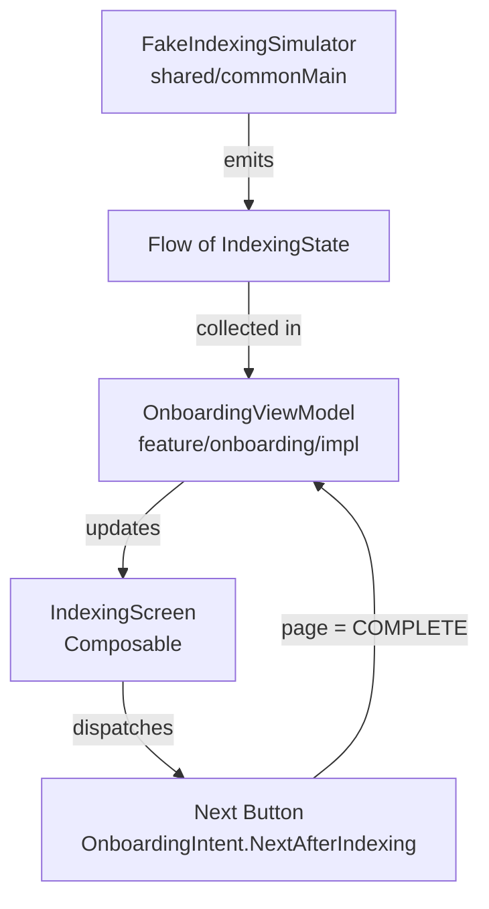

<!--firebender-plan
name: Indexing Screen
overview: Implement the Indexing screen (Screen 2) of onboarding, with fake progress simulation driven by KMP shared module business logic, following MVI + Google App Architecture.
todos:
  - id: shared-kmp
    content: "Add IndexingState, IndexingSimulator interface, and FakeIndexingSimulator to shared/commonMain (add coroutines dependency if missing)"
  - id: contract
    content: "Extend OnboardingContract: add indexing fields to UiState, NextAfterIndexing intent, NavigateToComplete effect"
  - id: di-module
    content: "Bind FakeIndexingSimulator in OnboardingModule via Hilt"
  - id: viewmodel
    content: "Inject IndexingSimulator into OnboardingViewModel and collect Flow on PermissionGranted; handle NextAfterIndexing"
  - id: indexing-screen
    content: "Build IndexingScreen composable matching the design: headline, system status card with gradient progress bar, palette swatches, blurred photo strip, purple Next button"
  - id: route-wire
    content: "Replace INDEXING placeholder in OnboardingRoute with IndexingScreen and handle NavigateToComplete effect"
-->

# Indexing Screen — Onboarding Screen 2

## Architecture & Data Flow



## Files to Create / Modify

### 1. KMP Shared module — new files in `shared/src/commonMain/kotlin/com/helios/auraroll/indexing/`

- **`IndexingState.kt`** — pure KMP data class:
  - `progress: Float` (0f–1f)
  - `processedCount: Int`
  - `detectedPaletteColors: List<Long>` (ARGB packed longs, platform-agnostic)

- **`IndexingSimulator.kt`** — interface:
  ```kotlin
  interface IndexingSimulator {
      fun simulate(): Flow<IndexingState>
  }
  ```

- **`FakeIndexingSimulator.kt`** — emits fake progress ticks via `delay(100)` up to 100%, with incrementing counts and growing palette list. Implements `IndexingSimulator`.

> May need to verify `kotlinx-coroutines-core` is in `shared/build.gradle.kts`; if not, add it.

### 2. `OnboardingContract.kt` — extend state and intents

- Add indexing fields to `OnboardingUiState`:
  - `indexingProgress: Float = 0f`
  - `indexingProcessedCount: Int = 0`
  - `indexingPaletteColors: List<Long> = emptyList()`
- Add intent: `data object NextAfterIndexing`
- Add effect: `data object NavigateToComplete`

### 3. `OnboardingModule.kt` — provide simulator via Hilt

Add a `@Provides` / `@Binds` binding for `IndexingSimulator → FakeIndexingSimulator`.

### 4. `OnboardingViewModel.kt` — inject and collect simulator

- Inject `IndexingSimulator` via constructor
- On `PermissionGranted`: advance page to INDEXING then `viewModelScope.launch { simulator.simulate().collect { state -> _uiState.update { ... } } }`
- On `NextAfterIndexing`: advance page to COMPLETE and emit `NavigateToComplete`

### 5. New `IndexingScreen.kt` in `feature/onboarding/impl/ui/`

Composable matching the design:
- Background: `Brush.verticalGradient` (same as `WelcomeScreen`)
- `systemBarsPadding()` + `padding(horizontal = 24.dp)`
- **Headline block**: `"Organizing your world."` in `displaySmall` Manrope, body copy in `bodyMedium`
- **System Status card** (`surface-container` background, rounded 24.dp):
  - `"SYSTEM STATUS"` — reuse `AuraBadge` (secondary color, uppercase)
  - `"Indexing Aura..."` + `"${(progress * 100).toInt()}%"` in `titleLarge`
  - **Gradient `LinearProgressIndicator`** from `secondary` → `tertiary` using a `Canvas` draw approach or `Box` with animated width
  - Row split:
    - Left: `"PROCESSED MEMORIES"` label + count with `Icons.Filled.AutoAwesome` sparkle
    - Right: `"DETECTED PALETTES"` label + row of `Box(CircleShape)` swatches from `indexingPaletteColors`
- **Blurred photo strip**: placeholder `Row` of 3 blurred dark `Box` cards (simulating obscured thumbnails)
- **`AuraPrimaryButton`** (`variant = Purple`, text = `"Next"`) at bottom, `enabled = progress >= 1f`

### 6. `OnboardingRoute.kt` — replace INDEXING placeholder

Wire `IndexingScreen(uiState, onNext = { vm.dispatch(NextAfterIndexing) })` into the `OnboardingPage.INDEXING` branch. Handle `NavigateToComplete` effect similarly to `NavigateToIndexing`.

## Key Design Tokens Used
- Progress bar gradient: `SecondaryFixed → TertiaryFixed` (purple → cyan)
- Card: `MaterialTheme.colorScheme.surfaceContainer`
- Badge label: `secondary` via existing `AuraBadge`
- Button: `AuraPrimaryButton(variant = Purple)`
