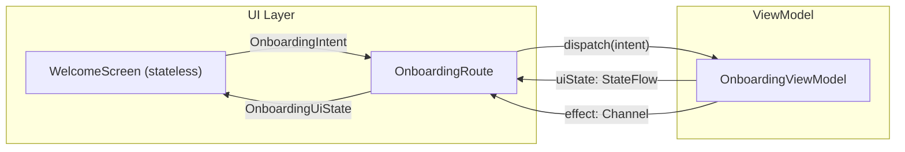

<!--firebender-plan
name: Onboarding Feature Implementation
overview: Build Screen 1 (Welcome/Permission) of the onboarding flow following Google App Architecture and MVI, laying the foundation for Screens 2 and 3 later.
todos:
  - id: designsystem-components
    content: "Add reusable components to core/designsystem: AuraPrimaryButton (white + purple variants), AuraGhostButton, AuraPageIndicator, AuraBadge"
  - id: onboarding-contract
    content: "Define MVI contract in onboarding/impl: OnboardingUiState, OnboardingIntent sealed class, OnboardingEffect sealed class"
  - id: onboarding-viewmodel
    content: "Create OnboardingViewModel with intent channel, state reduce, and effect channel — handling GrantPermission + PermissionGranted/Denied intents for Screen 1"
  - id: welcome-screen
    content: "Implement WelcomeScreen composable: hero illustration, headline, privacy badge, body text, Grant Permission + Learn how it works buttons, 2-dot page indicator"
  - id: onboarding-route
    content: "Create OnboardingRoute composable collecting state/effects, handling permission launcher, rendering WelcomeScreen"
  - id: di-module
    content: "Update OnboardingModule.kt to replace placeholder with OnboardingRoute"
-->

# Onboarding — Screen 1: Welcome/Permission

## What We're Building

Screen 1 from the Figma design: the Welcome screen that introduces Aura Roll and requests `READ_MEDIA_IMAGES` permission.

## MVI Architecture for Screen 1



**MVI Contract** (extensible for Screens 2 & 3 later):
```
OnboardingUiState(
    page: OnboardingPage,       // WELCOME | INDEXING | COMPLETE
    isLoading: Boolean
)

sealed interface OnboardingIntent {
    data object GrantPermission : OnboardingIntent      // user taps button
    data object PermissionGranted : OnboardingIntent    // system callback
    data object PermissionDenied : OnboardingIntent
    data object LearnHowItWorks : OnboardingIntent
}

sealed interface OnboardingEffect {
    data object LaunchPermissionRequest : OnboardingEffect
    data object NavigateToIndexing : OnboardingEffect
}
```

- `OnboardingViewModel` holds a `MutableStateFlow<OnboardingUiState>` and a `Channel<OnboardingEffect>`.
- `OnboardingRoute` is the stateful composable: collects state, observes effects in `LaunchedEffect`, launches system permission dialog, passes lambdas down to `WelcomeScreen`.
- `WelcomeScreen` is **fully stateless** — receives `uiState` + callbacks only.

## Screen 1 Layout (Figma-faithful)

```
┌─────────────────────────────┐
│  [Hero Illustration]        │  ← Composable illustration: two stacked
│   camera card + palette     │    dark cards + circular swirl photo,
│   card + swirl circle       │    built with Compose shapes + icons
├───────────────���───────��─────┤
│  "See your memories         │  ← displaySmall, Manrope Light, centered
│   in a new light."          │
│                             │
│  "Aura Roll re-imagines..." │  ← bodyMedium, OnSurfaceVariant, centered
│                             │
│  🛡 PRIVACY FIRST           │  ← AuraBadge (pill, OutlineVariant border)
│                             │
│  "Zero cloud processing..." │  ← bodySmall, OnSurfaceVariant, centered
├─────────────────────────────┤
│  [Grant Permission]         │  ← AuraPrimaryButton(variant=White)
│  [Learn how it works]       │  ← AuraGhostButton
│       •  ○                  │  ← AuraPageIndicator(total=2, current=0)
└─────────────────────────────┘
```

## Files to Create / Modify

### `core/designsystem` — Reusable components
- **New** `components/AuraPrimaryButton.kt` — `enum ButtonVariant { White, Purple }`. `White`: `onBackground` fill + `background` text. `Purple`: brush gradient `SecondaryFixed`→`SecondaryFixedDim`, `OnSecondary` text.
- **New** `components/AuraGhostButton.kt` — transparent bg, `onSurface` text, no border.
- **New** `components/AuraPageIndicator.kt` — row of dots; active dot = elongated rounded pill (width animates), inactive = small circle; uses `secondary` for active, `onSurfaceVariant` for inactive.
- **New** `components/AuraBadge.kt` — pill with `OutlineVariant` ghost border at 15% opacity, optional leading `ImageVector` icon, `labelSmall` text in `secondary` color.

### `feature/onboarding/impl`
- **New** `ui/OnboardingContract.kt` — `OnboardingUiState`, `OnboardingPage` enum, `OnboardingIntent`, `OnboardingEffect`
- **New** `ui/OnboardingViewModel.kt` — `@HiltViewModel`, `StateFlow<OnboardingUiState>`, `Channel<OnboardingEffect>`, `fun dispatch(intent: OnboardingIntent)`
- **New** `ui/OnboardingRoute.kt` — stateful root composable; `hiltViewModel()`, permission launcher, effect observer
- **New** `ui/WelcomeScreen.kt` — stateless composable with hero, text, badge, buttons, indicator
- **New** `ui/components/HeroIllustration.kt` — Compose-drawn hero (no bitmap assets required)
- **Modify** `di/OnboardingModule.kt` — replace `Box+Text` placeholder with `OnboardingRoute()`

## Design Token Reference

- Background: `MaterialTheme.colorScheme.background` (`#0E0E0E`)
- Headline: `MaterialTheme.typography.displaySmall`, Manrope Light, `onBackground`
- Body: `MaterialTheme.typography.bodyMedium`, Inter, `onSurfaceVariant`
- Badge border: `OutlineVariant` at 15% alpha
- Badge label: `labelSmall`, `secondary` (`#AC89FF`)
- White button: `onBackground` (`#F9F9F9`) bg, `background` text, `shape = RoundedCornerShape(50%)`
- Purple button: gradient brush `SecondaryFixed`→`SecondaryFixedDim`, `OnSecondary` text
- Page dots: `secondary` active, `onSurfaceVariant` inactive
