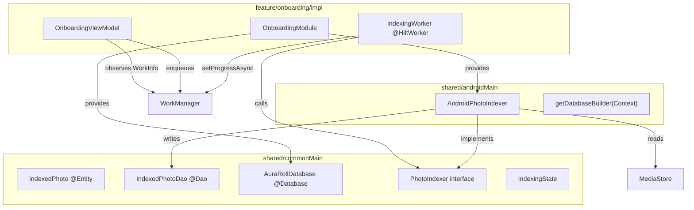

<!--firebender-plan
name: Real Photo Indexer
overview: Implement real Android photo indexing: scan MediaStore, extract dominant HSV color per image, persist results to a KMP Room database, and run the heavy scan inside a WorkManager job for background-safe processing. All DB schema/DAO/repository contracts live in the KMP shared module.
todos:
  - id: deps
    content: "Add Room KMP plugin, KSP, and Palette deps to libs.versions.toml and shared/build.gradle.kts"
  - id: room-schema
    content: "Create IndexedPhoto entity, IndexedPhotoDao, and AuraRollDatabase in shared/commonMain"
  - id: rename-interface
    content: "Rename IndexingSimulator -> PhotoIndexer and update FakeIndexingSimulator"
  - id: android-indexer
    content: "Implement AndroidPhotoIndexer in shared/androidMain (MediaStore + Palette + HSV + Room insert)"
  - id: db-provider
    content: "Create getDatabaseBuilder in shared/androidMain"
  - id: worker
    content: "Create IndexingWorker with @HiltWorker and update onboarding/impl build.gradle.kts"
  - id: hilt-di
    content: "Create DatabaseModule (SingletonComponent) and update OnboardingModule to bind AndroidPhotoIndexer"
  - id: viewmodel
    content: "Update OnboardingViewModel to enqueue WorkManager and observe WorkInfo + DAO flows"
-->

# Real Photo Indexer — KMP Room + WorkManager

## Architecture



## Step 1 — Dependencies

**[`gradle/libs.versions.toml`](gradle/libs.versions.toml)**
- Add `room-gradle-plugin` library entry: `{ id = "androidx.room", version.ref = "room" }` under `[plugins]`
- Add `androidx-palette-ktx = { group = "androidx.palette", name = "palette-ktx", version = "1.0.0" }` under `[libraries]`

**[`shared/build.gradle.kts`](shared/build.gradle.kts)**
- Add `ksp` and `room` plugins
- Add `room { schemaDirectory(...) }` block
- Add `androidx.room.runtime` to `commonMain.dependencies`
- Add `androidx.palette.ktx` to `androidMain.dependencies`
- Add KSP Room compiler: `add("kspAndroid", libs.androidx.room.compiler)`

## Step 2 — Room schema in `shared/commonMain`

**New `shared/src/commonMain/.../database/IndexedPhoto.kt`**
```kotlin
@Entity(tableName = "indexed_photos", indices = [Index("hue")])
data class IndexedPhoto(
    @PrimaryKey val id: Long,       // MediaStore image ID
    val uri: String,
    val hue: Float?,                // 0–360; null = monochrome
    val saturation: Float,
    val brightness: Float,          // HSV value
    val isMonochrome: Boolean,
    val dominantColorArgb: Long     // packed ARGB for palette swatches
)
```

**New `shared/src/commonMain/.../database/IndexedPhotoDao.kt`**
- `@Insert(onConflict = REPLACE) suspend fun insert(photo: IndexedPhoto)`
- `@Query("SELECT COUNT(*) FROM indexed_photos") fun countAll(): Flow<Int>`
- `@Query("SELECT DISTINCT dominantColorArgb FROM indexed_photos ... LIMIT 5") fun sampleColors(): Flow<List<Long>>`

**New `shared/src/commonMain/.../database/AuraRollDatabase.kt`**
```kotlin
@Database(entities = [IndexedPhoto::class], version = 1)
abstract class AuraRollDatabase : RoomDatabase() {
    abstract fun indexedPhotoDao(): IndexedPhotoDao
}
```

**Update `shared/src/commonMain/.../indexing/PhotoIndexer.kt`**  
Rename `IndexingSimulator` → `PhotoIndexer`, keep `simulate()` renamed to `index()`. Update `FakeIndexingSimulator` to implement the renamed interface.

## Step 3 — Android implementation in `shared/androidMain`

**New `shared/src/androidMain/.../database/DatabaseProvider.kt`**
```kotlin
fun getDatabaseBuilder(context: Context): RoomDatabase.Builder<AuraRollDatabase> =
    Room.databaseBuilder<AuraRollDatabase>(
        context = context.applicationContext,
        name = "auraroll.db"
    )
```

**New `shared/src/androidMain/.../indexing/AndroidPhotoIndexer.kt`**
- Queries MediaStore with `ContentResolver.query()` for all `Images.Media` rows (id, data, size)
- For each image: decode a `50×50` thumbnail using `BitmapFactory.Options.inSampleSize`
- Use `AndroidX Palette.from(bitmap).generate()` to extract the dominant swatch
- Convert the swatch RGB → HSV via `Color.RGBToHSV(r, g, b, hsv)`
- Apply monochrome logic: `hsv[1] < 0.1f || hsv[2] < 0.1f` → `isMonochrome = true`, `hue = null`
- Insert `IndexedPhoto` into `IndexedPhotoDao`
- Emit `IndexingState(progress, processedCount, paletteColors)` after each batch

## Step 4 — WorkManager Worker

**New `feature/onboarding/impl/.../IndexingWorker.kt`**
```kotlin
@HiltWorker
class IndexingWorker @AssistedInject constructor(
    @Assisted ctx: Context,
    @Assisted params: WorkerParameters,
    private val indexer: PhotoIndexer
) : CoroutineWorker(ctx, params) {
    override suspend fun doWork(): Result {
        indexer.index().collect { state ->
            setProgressAsync(workDataOf(
                KEY_PROGRESS to state.progress,
                KEY_COUNT to state.processedCount
            ))
        }
        return Result.success()
    }
}
```

Also add `androidx-hilt-work` and `androidx-hilt-compiler` to `feature/onboarding/impl/build.gradle.kts`.

## Step 5 — Hilt DI updates

**Update [`feature/onboarding/impl/.../di/OnboardingModule.kt`](feature/onboarding/impl/src/main/java/com/helios/auraroll/onboarding/impl/di/OnboardingModule.kt)**
- Move DB / DAO to `@InstallIn(SingletonComponent::class)` module (new `DatabaseModule.kt`)
- Provide `AuraRollDatabase` as `@Singleton` via `getDatabaseBuilder(context).build()`
- Provide `IndexedPhotoDao`
- Bind `AndroidPhotoIndexer` as `PhotoIndexer`

## Step 6 — ViewModel update

**Update [`OnboardingViewModel.kt`](feature/onboarding/impl/src/main/java/com/helios/auraroll/onboarding/impl/ui/OnboardingViewModel.kt)**
- Inject `WorkManager` and `IndexedPhotoDao`
- On `PermissionGranted`: enqueue `OneTimeWorkRequest<IndexingWorker>` with a stable tag
- Observe `workManager.getWorkInfoByTagFlow(TAG)` → map `workInfo.progress` → update `OnboardingUiState`
- Observe `dao.countAll()` → update `indexingProcessedCount`
- Observe `dao.sampleColors()` → update `indexingPaletteColors`
